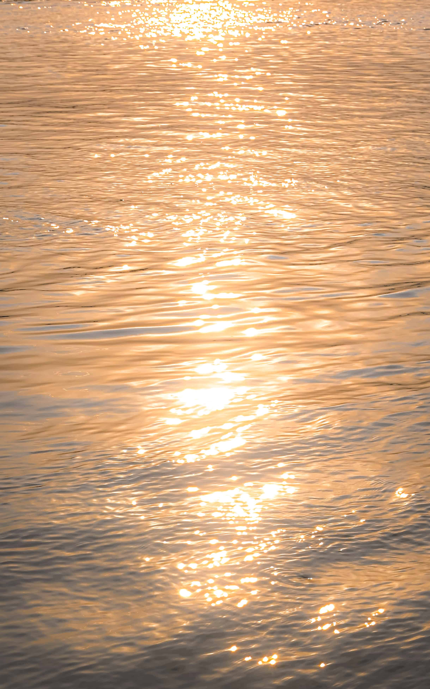
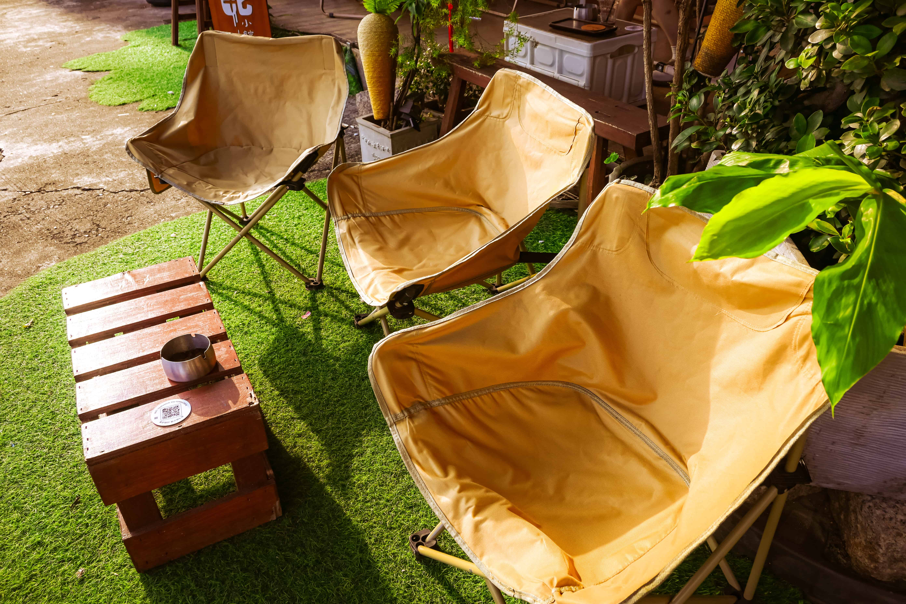
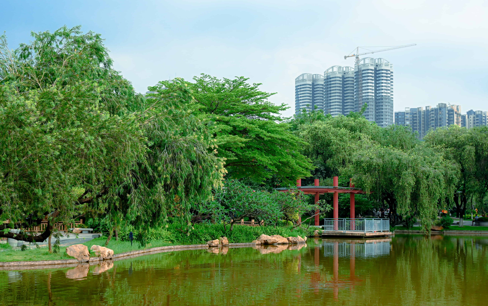
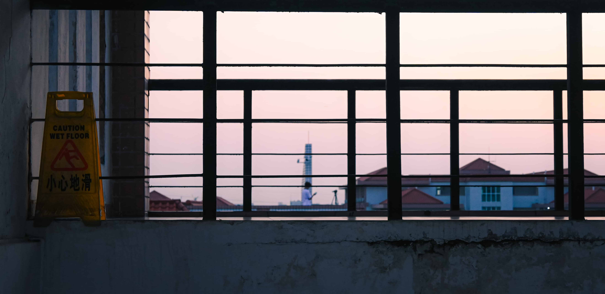
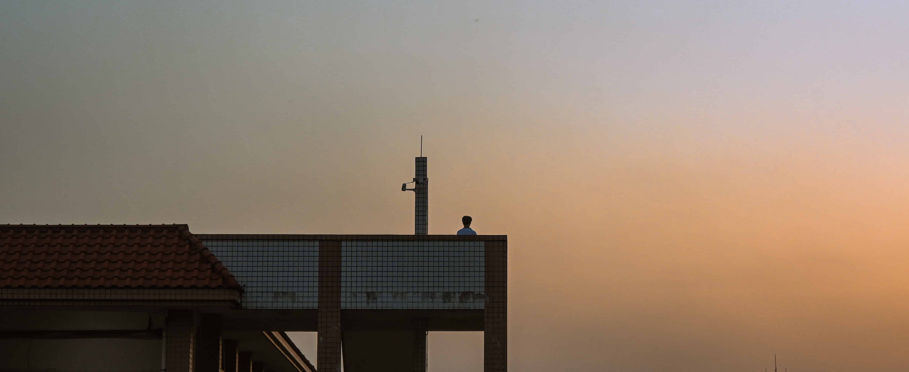
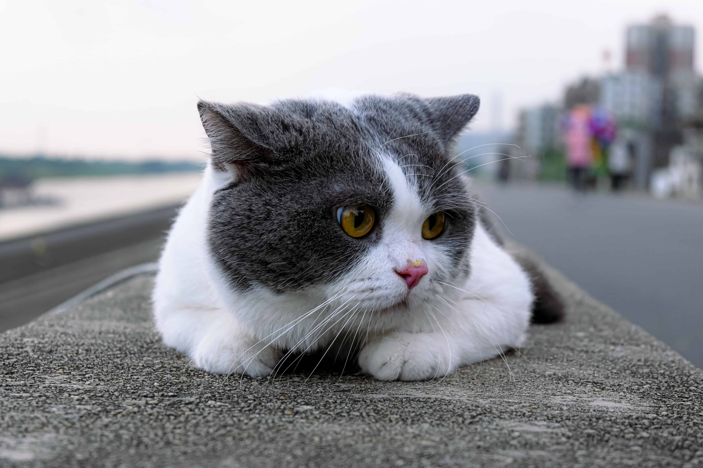
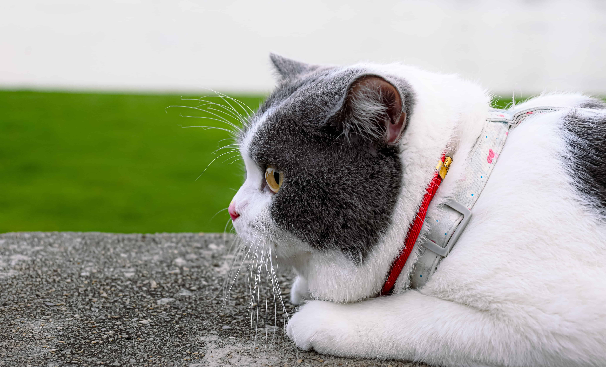
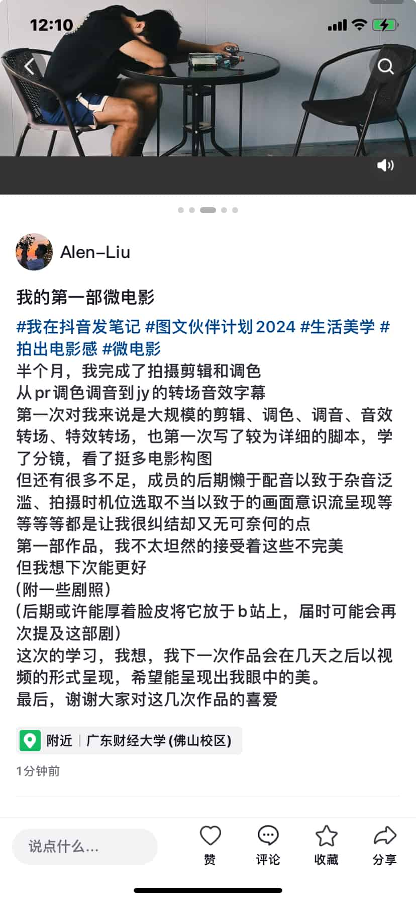
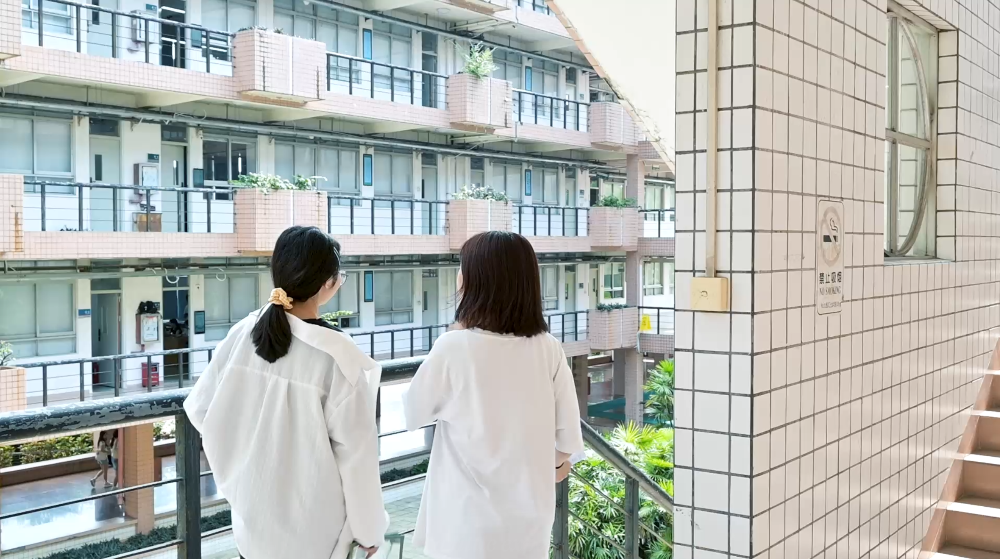

## 🤓前言
2024年5月18日，本该是我的发文日。但由于18日在进一步完善我的视频，又恰巧20日这个具有社会广泛特色认同性的日子将至，因此我决定在5月19日这尴尬的一天发表我的博客（~~哈哈哈哈无厘头是我没错了~~）

由于这个月的学习都是一些基础性的东西，所以可能需要在之后才会发相关的相对高阶的摄影学习分享（~~大佬实在是太多了，不敢班门弄斧~~），这期我想还会是书写我的一些话语吧

---

## ✍🏼焦虑

---

是的，我想我并不拥有相对好事物的配得感，不论其是否存在爱。我将这篇矫情文搬上了我的抖音，收到的评论却让我暖心红框，<code>真的很感谢。</code>

或许我急切需要如同她所说一般，能够坦然的接受这份爱与幸福，但我想，在我还未达到与之匹配的时候，我尚且做不到。

我的焦虑或许并不只是不配得感为导因的事件所招致的

我的专业的导向性丧失，或许才是最大的导因。

我曾自以为了解工商管理类的泛性，但在面对它的时候还是会显得措手不及，我不知道这些所谓的专业知识是否已然脱轨却又不得不上，我不知道众人所说的就业危机是否能够因个人能力而被极大程度上的被挽救，我也不知道我需要提升到何种程度才能被称为所谓的个人能力强，我也不知道我的好高骛远是否能填补我那可能无法成为超级个体的白日梦

在得知我的这个专业分流的新颖性时，我是没底气的

我也对于需要往哪个方向，这个方向需要什么，有了这些技能是否就能解救就业焦虑的诸如此类的问题一筹莫展

船到桥头自然直，但前提是有桥

我知道我的丧气话透露着我的无知与无为，但我想我会一直探索，或许在不久的将来，我能够有确切的答案

---

## 🫂接受

接受着拥有Nikon-Z30的幸福感，接受着家人无条件的爱意，接受着自己的迷茫

我在这一个月里，留下了一些镜语

4月20日14：10分，在发完我的《四月中旬》这篇博客之后，我拍下来第一组让我感动的照片

这一组照片有6张，选取三张最满意的予大家。

<code>这是我第一次拍雨，我很感动，能拍出来这种效果，我也真的很喜欢这组照片</code>

希望屏幕前的你们也能够喜欢

---

在5月11号那天，我又一次留下了感动

📘蓝调是我很喜欢的色调之一，我也始终在找寻着能表达我情绪的蓝调

或许色调不一，细节不一，但我想每张照片都有在很好地表达着当时的舒适

---
📙我曾想过要拍一组波光粼粼、金光闪闪的照片,很高兴，也很幸运，在奔跑了10min后，我终于拍下了这一组照片

希望这一刻的光也能让屏幕前的你感到开心

---

📗作为绿调的忠实fans，我却每次都不能够很好的拍出来想要的效果。这一组是自己尝试的后期仿胶片（嗯，全靠感觉🙈）

(扶额苦笑)🤦🏼‍♂️。。看来，越喜欢的越糟糕哈哈哈......

---

🎞️接下来这组是我极简构图的第一次尝试，这次的预设自己调了很久，最终做出来了自己的关于这个色调的预设

---

同时，也为同样身为摄影爱好者的初面者拍了两张马马虎虎的照片

---

🐈‍⬛最后，用一组小猫的照片结束这一个栏目吧

---

## 📽️进步

忙活一个月，从写脚本到拍摄，再到后面的剪辑、调色、调音、转场、字幕、音效，我一个人做了一个团队的基本事务，这样的大规模的工作确乎让我学到了很多

但毕竟是小组作业，有些事情确实是力不从心，也确实没办法做到我心目中的极致

就这样，我的作品不上不下，但我也坦然接受了，毕竟能学到东西总归不差

这也便是我在账号上写的粗略笔记以及一些剧照了

---

## 🎈末语

我将我的其余照片都放在了[AlenLiu's Gallery](https://gallery.alenliu.space/)里，希望你来，希望你能喜欢

六月，希望我的四级证书能到手，也希望我能够做我所喜爱的所谓有氛围感的短视频

最后，以这个视频来纪念我的第一款相机（Canon600D），这也是它留下的最后的影像

汗暑无常，伏惟珍重

愿安好，我们六月见👋🏼