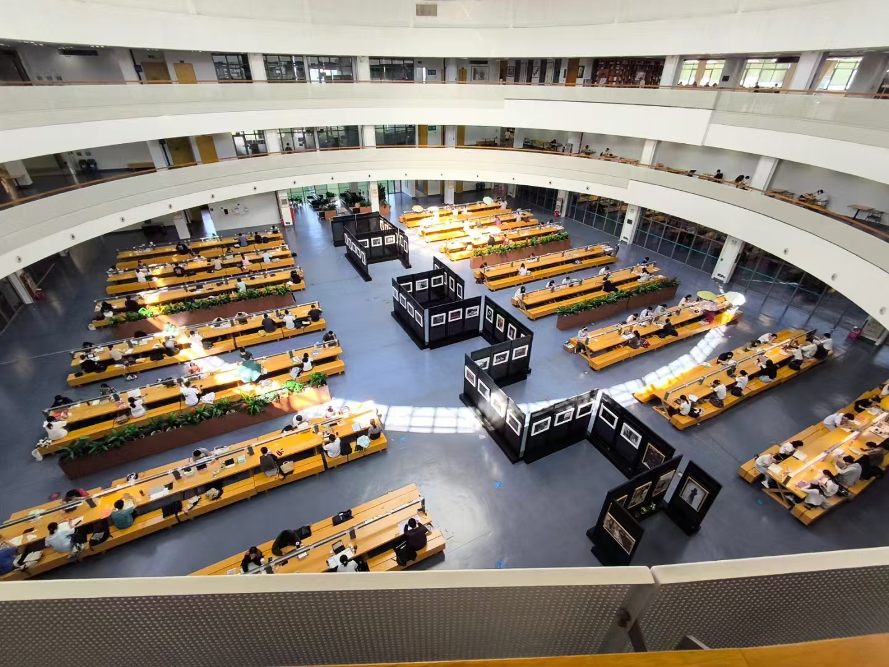
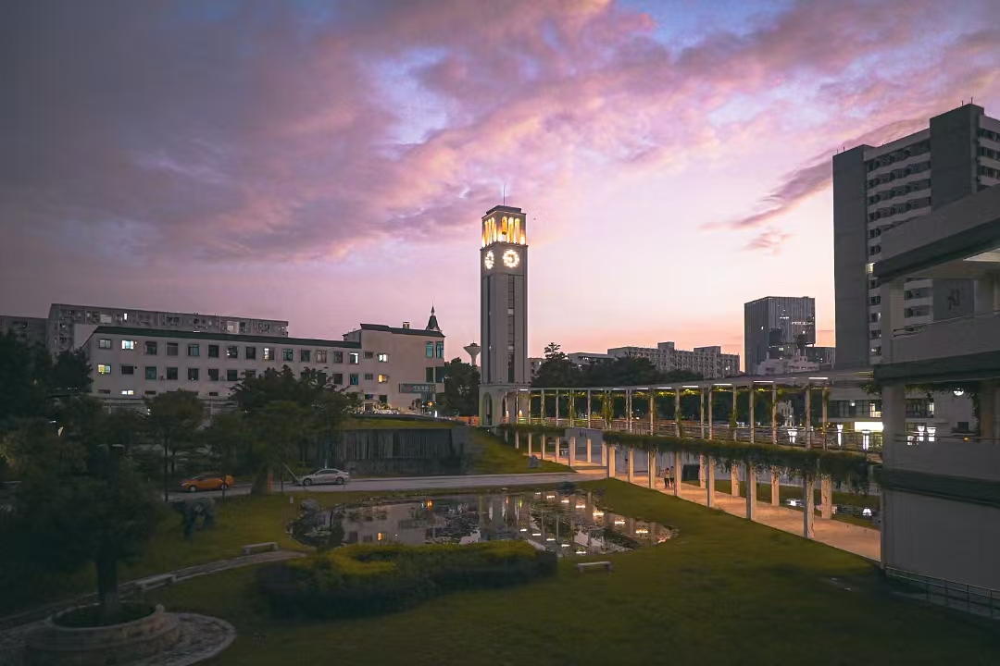
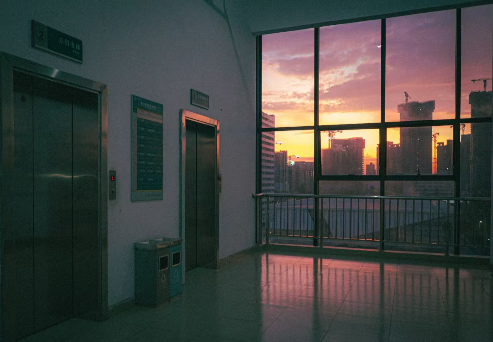
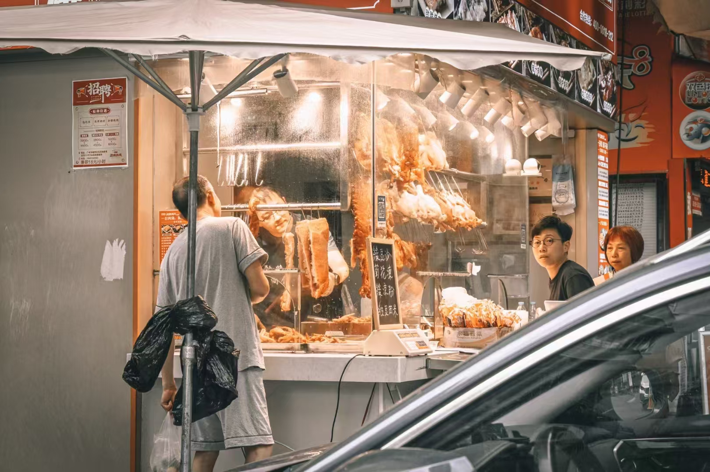
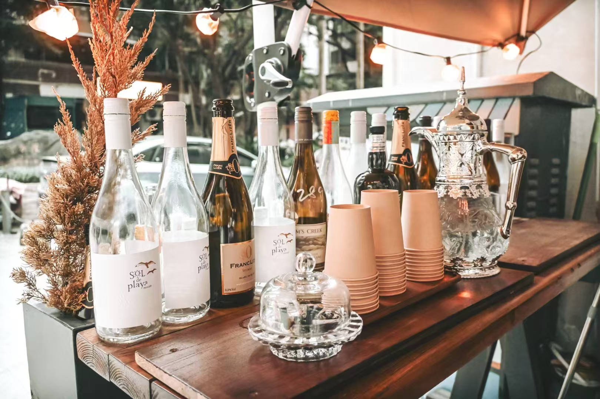

## 前言☔

断断续续，在这三天的假期里我终于能够安静的写一篇博客了

新环境的潮闷，对于我来说和去年山里的潮闷一样讨厌...

---

## 或许成长必要条件就是苦难与羞愧🫂

之前同M叔聊过成长，其中有一句话让我印象比较深刻

	一个相对于同龄人来说的成熟的人，他的成熟或者得益于他的先天优越家庭，或者受难于他的羞愧与苦难。当训言有了实质的物质反馈或者是精神冲击的时候，训言才是真正的训言。

起初我并没有很在意这句话，认为它只是一般的普适性教育语录。之后发生了许许多多的事情，接触到的各人各事，我才发现，这句话或许便是血与泪的结晶。

或许我这个年龄段所接触到的人还算不上是完全社会化的人，但所谓成长与成熟的外显，也恰好能够在这个阶段所体现。

对话是能够让人有朦胧性概念的行为，我的对语也在增加。

所谓成熟，一般是相对高位者对相对低位者的评判，所以**我不评论任何人的成熟与否，因为所有对语者都是平等的**

我们探讨成长

至少在我狭隘的对语世界中的事实表明，家庭，或许只是对于受体的教育概念起到量的叠加作用，但这并不代表概念的实质能够在受体身上完美的行使出来，又或许，量的叠加这一功能的有效性还有待以商榷..

我们走在路上，我们常被绊倒或或将被绊倒时，才是所谓教育概念的实质性呈现。

我们被绊倒时的苦难与或将被绊倒时的羞愧，才是一把铁锤，将教育钢印烙在我们的心头

**他们无足轻重，因为他们毫无重量**

**他们举足轻重，因为他们锱铢必较**

或许成长的必要条件就是苦难与羞愧

又或许苦难和羞愧就是成长，谁知道呢？

---

## 镜语录📸

好久不见系列

九月底到十一月，我的崴脚始终迟迟未愈，这也致使我的拍摄空白了很长一段时间

---

### 九月十六，我的第一个爆款🌋

我的第一个破万浏览量图文

我想，更多的是校友的力量

但我也更希望是我的照片足够好👋🏼😭👋🏼

---

### 十一月三号，黑金扫街系列🚲

阴天确实不好出片

只能另寻其道拍出这一种风格（*~~毕竟路费不能白花~~*）

---

### 双十一光棍节 ，人像Ⅰ👧

尼康佬拍人像只有两种可能性

1. 单子太大了，不收对不起自己
2. 和朋友出去，不得不拍

我。。。属于第二种🤣🤣（*~~什么时候我也能接到大单子😭😭 ~~*）

第一次去宝丽来店拍照（羞涩🤪）

u1s1，这个店的装修确实下了不少功夫

我想这也是为什么他能收较高价格的原因之一吧

---

### 双十一光棍节，人像拍摄的场地照☕

既然都花钱探店了，为啥不拍店呢？😏于是这组照片便就出来了

这组照片我很努力的想要达到一种胶片感

但一些数码感还是消除不掉

或许之后lr的进阶用法会有助于这一点

希望我能够修出真正的仿胶片照片

---

---

镜语录系列到此就暂且告一段落啦！期待我的镜语录年末作品与大家的再次见面😆👋🏼

希望我们都能够进步🐾

	To be continue...

---

## 末语🛏️

近期也尝试着慢慢添置一些设备，等设备攒齐之后我想我会写一期这学期的好物分享

并非科技大佬的我，或许好物包括但不限于数码、穿搭衣物、便携好物、奇奇怪怪的物品

期待下一次跟大家的见面

我们下篇文章再见👋🏼

---

