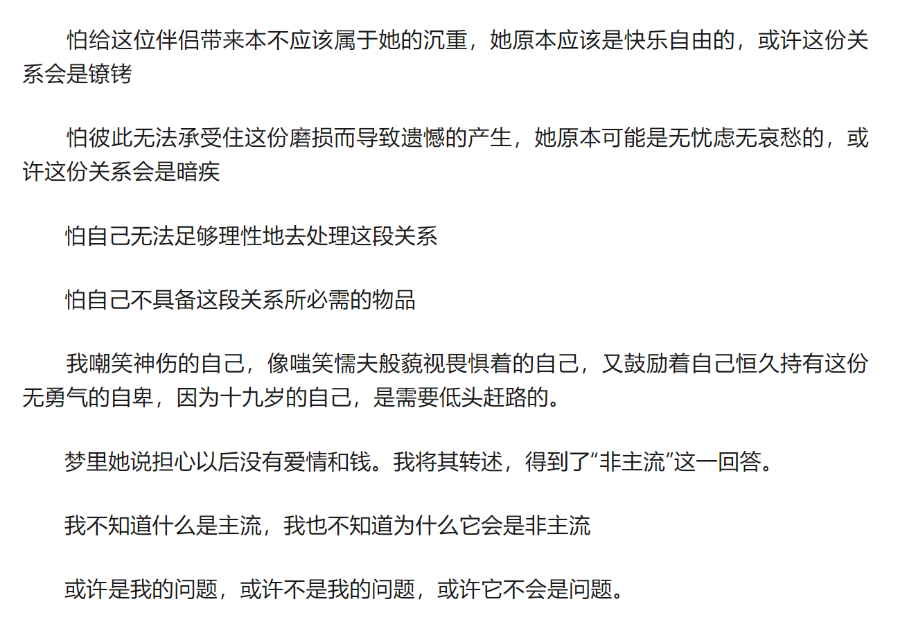
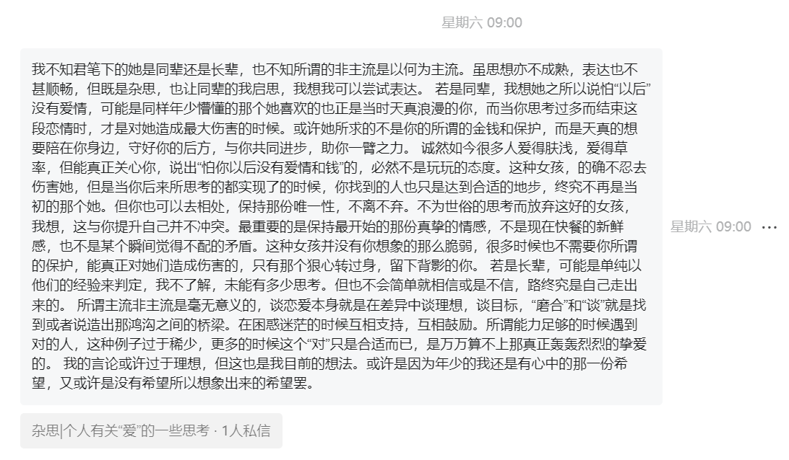
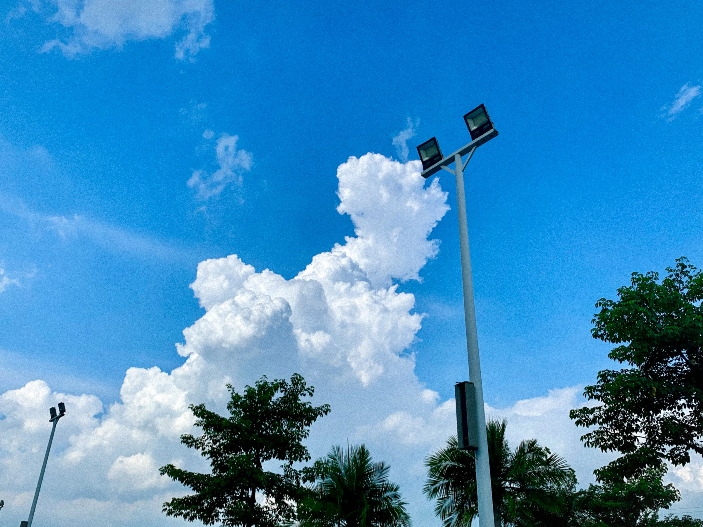
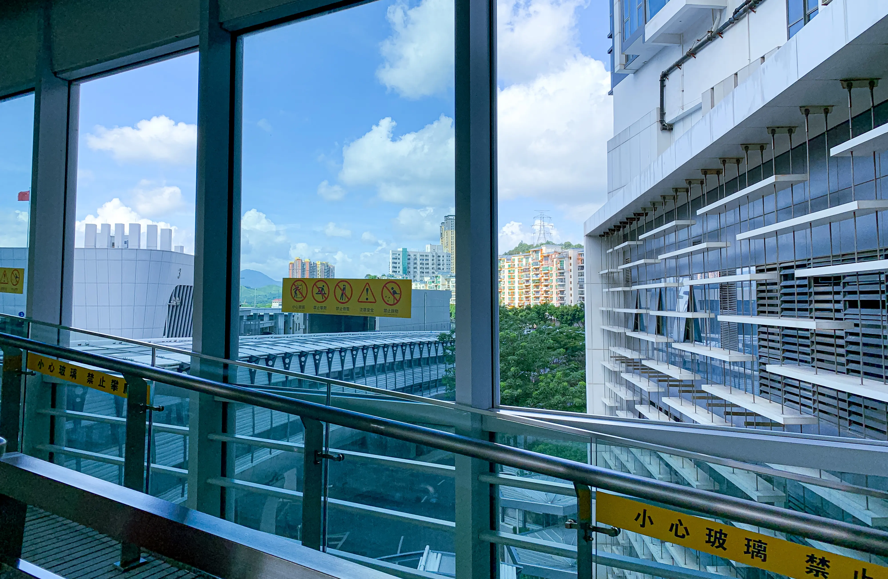

## 📝前言

距离上一篇博客已经有一个月的时间啦。

不知道为什么，每个月的*十八号这天*我才能够想起来我的博客需要更新。

或许我应该暂定十八号为固定发文日吧哈哈哈，也督促着自己要能够不断的进行创作吧。

---

## 🛋️继Blog，我创建了我的公众号以及相应的抖音

### 🥳缘起

在前两篇文章中，我曾提到过博客是我写字的地方。之后在小南老师的启发下，我想，拥有博客与拥有公众号并不冲突，甚至二者是相辅相成的。所以，在创作心情高涨时，我**建立了我的第一个公众号“无墨砚”，并将其与这个博客网站进行了关联。**

### 🤔公众号的名字

对于<code>腹中无墨</code>的我而言，起名字无疑是我最致命的一个弱点。

我试图用GPT帮我想几个，但目前ai终究是一个信息处理工具，并不能够给予我太多满意的地方。感叹小南老师之公众号“木林深”的唯美，我深思其是否也能如此这般动人，最终绞尽脑汁想出来了这么一个**符合我现实性质却又无半点唯美度**的名字———“无墨砚”

<code>“无墨砚”或许真如我目前这般状态———执笔无思，观砚无墨</code>

---

### 🤓关于我的公众号

	无墨砚，无墨烟，无墨言，无墨，无砚，无烟，无言，无颜.

<code>或许词不达意，或许无字繁琐，或许冗杂无感，但这就是我目前的贫瘠所能想出来的最好介绍。</code>

---

#### 🙈POST 1

---

24年3月31号晚凌晨2点，我写下了这十九年来第二篇令自己泪眼的文章。

第一篇是记忆中所有有关父亲的回忆。那是20年秋写的了。

----

#### 🙈POST 2

---

24年4月12号晚。我又一次梦见她。梦中她说怕以后没有爱情和钱，她不想那样。我没说话。

24年4月13号晚。我提笔写下这篇自嘲。

<code>我很高兴，我这样的写字者也能够拥有这样的读者。我也很庆幸，我还有人会去挽救我那无可救药的看似现实主义的愚钝。即便我不知道什么叫不愚钝。</code>

---

#### 🤳🏼创建无墨砚的抖音号

	我并不在意流量与收益，也无意将其当主业，这只是我书写自己的一部分，也是支持我热爱的一部分。

这是我曾对朋友说过的话，是的，至少在这个阶段，<code>我希望我所运营的所有能够尽可能的纯粹</code>

我想在大学这四年里，或许这个想法会一直适用（~~关键是我也不持有成为网红的资本~~）

---

## 📸重拾摄影
	建站的这一个月里，我基本没碰过相机。

使用手机摄影久了，便容易忘却相机本身远超手机的相片影像质感的性质。渐渐的，在质感落差陷阱中，我失去了对摄影的激情。<code>更多时候，我只是将它定格在我的眸幕中</code>，因为我知道，我无法将其更加完美的还原。

大心心理剧是重燃我激情的一个媒介

接过编剧的剧本，我开始构思我的心理剧拍摄，在完成长达5h的构思与脚本编写，我对脚本中的80个镜头产生了激情。但由于这只是个小组作业，考虑到其他人为因素，我降低了我对这部短剧的要求。因为他们不必要陪我积极。但拍摄空镜时，我意识到，<code>我始终是爱着摄影和美的.</code>

虽说如此，但终究繁忙依旧，所以只选取了一些自认为具有相对氛围感的照片与影像放在这里啦。

佛山三水北江大堤时孩童玩耍时shot

今年的第一张夏天

夏天真的很热，我需要蓝色。

---

接下来就是在宿舍拍的空镜啦，以此开启我宿舍的夏天

<video controls src="宿舍1.mp4" title="Title"></video>
	阳台

<video controls src="宿舍2.mp4" title="Title"></video>

	阳台之外

在视频中有加入所谓bgm以营造所谓氛围感，虽然我更想还原它的真实声音，可是视频实在太大，加载起来的时间是一个很大的问题

<code>**对我来说，声音、气味、气候，都有记忆。**</code>

---
## 🎈尾声

五月，<code>**我想会做出我导演的第一部短剧，会写出再次令我满意的作品。**</code>

期待与大家的再一次见面。👋🏼